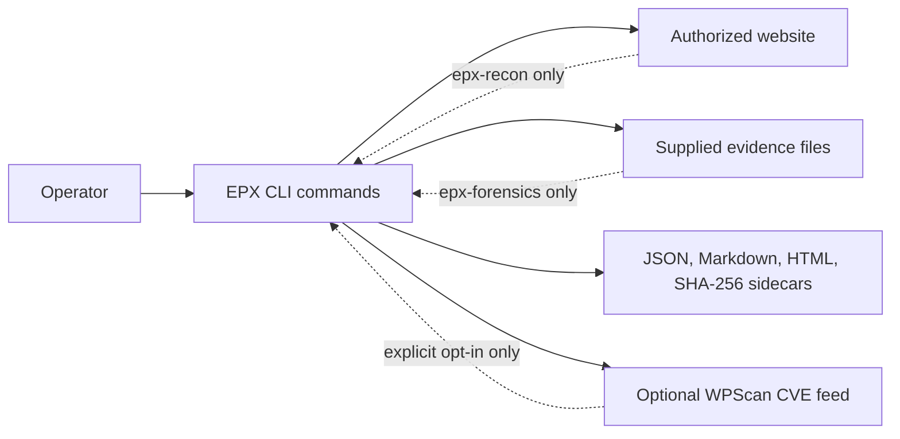
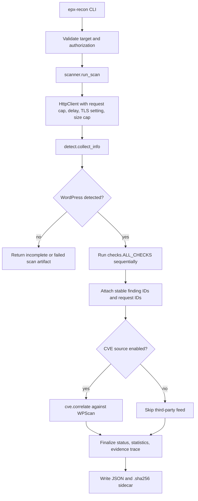
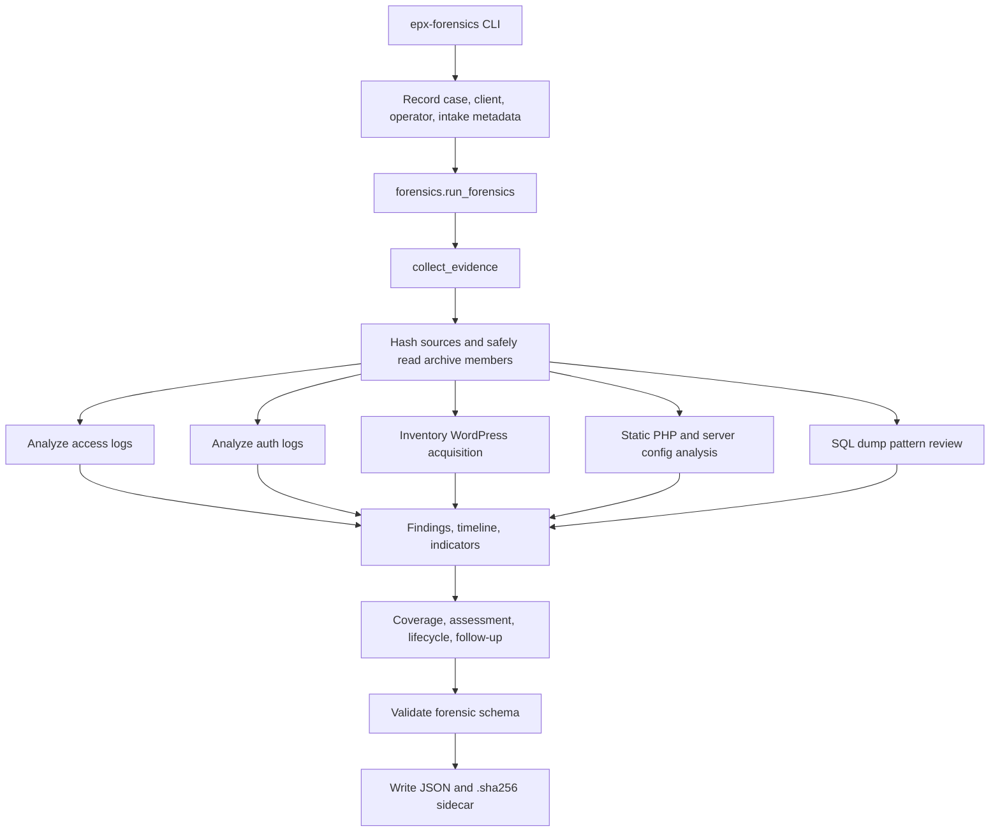
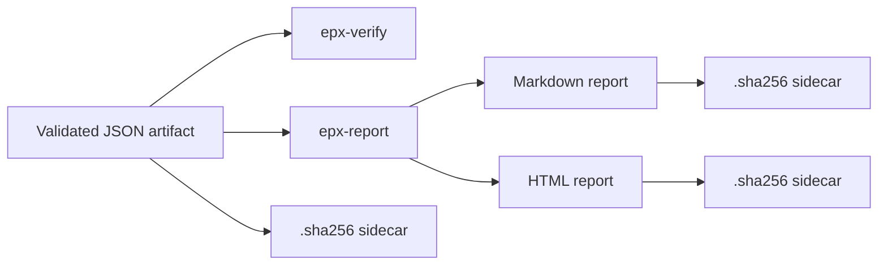

# Architecture

This document describes the structure of the ePotala Security Toolkit and the
main design decisions behind it.

## System Context

The toolkit is a dependency-free Python 3.10+ command-line application for two
related workflows:

- authorized, read-only external WordPress/WooCommerce reconnaissance;
- offline incident-evidence analysis of supplied logs, archives, WordPress
  projects, PHP/server artifacts, and SQL dumps.

It does not run as a daemon, does not keep a database, and does not require a
web service. Each command reads CLI arguments, performs one bounded task, writes
an artifact when requested, and exits.



## Command Surface

| Command | Primary module path | Purpose | Network activity |
|---|---|---|---|
| `epx-recon` | `epxtool.scanner` | Authorized external website assessment | Target host only; optional third-party CVE feed |
| `epx-forensics` | `epxtool.forensics` | Offline static incident-evidence analysis | None |
| `epx-report` | `epxtool.report`, `epxtool.forensics_report` | Render JSON artifacts as Markdown or HTML | None |
| `epx-verify` | `epxtool.io_utils`, schemas | Verify SHA-256 sidecars and JSON schemas | None |

The command scripts are thin adapters. They validate CLI arguments, collect
operator metadata, call package modules, and write or print output.

## Package Layout

| Module | Responsibility |
|---|---|
| `epxtool.scanner` | Coordinates external scans, authorization metadata, check execution, status, statistics, and evidence trace attachment. |
| `epxtool.http_helper` | Bounded HTTP client, same-site redirect control, request delay, response-size caps, request IDs, and hash-only request traces. |
| `epxtool.detect` | One-time WordPress discovery: reachability, server header, WordPress markers, version, components, users, and selected headers. |
| `epxtool.checks` | Ordered read-only assessment checks. New online checks are added to `ALL_CHECKS`. |
| `epxtool.cve` | Optional WPScan correlation. This is separated because it sends component inventory to a third party. |
| `epxtool.findings` | Common finding shape, severity ordering, confidence values, and finding sorting/counting helpers. |
| `epxtool.attack` | Hand-curated MITRE ATT&CK references used by findings and reports. |
| `epxtool.forensics` | Offline evidence collection, archive/member handling, log parsing, WordPress inventory, static artifact analysis, SQL pattern review, timeline and indicator generation. |
| `epxtool.schema` | Validation for external scan JSON artifacts. |
| `epxtool.forensics_schema` | Validation for forensic JSON artifacts. |
| `epxtool.report` | Markdown and HTML rendering for external scan artifacts. |
| `epxtool.forensics_report` | Markdown and HTML rendering for forensic artifacts. |
| `epxtool.io_utils` | Atomic artifact writes, SHA-256 sidecars, file hashing, and integrity verification. |

## External Scan Flow



Important scan properties:

- Scans are read-only by design. Checks do not log in, exploit, brute force, or
  modify target state.
- Requests are bounded by `max_requests`, `timeout`, `delay`, and
  `max_response_bytes`.
- Redirects are constrained to the authorized host and cannot downgrade HTTPS.
- HTTP evidence stores request metadata and response SHA-256 hashes, not full
  response bodies.
- Discovery and checks are failure-isolated. A failed detector or check records
  errors and produces a failed or incomplete artifact instead of crashing the
  whole command.

## Forensic Analysis Flow



Important forensic properties:

- Evidence is analyzed offline. Supplied code is read as data and is not
  executed.
- Source files and archive members are hashed and tracked with stable evidence
  references.
- Archive processing rejects unsafe paths and enforces member-count and size
  limits.
- Log parsing is conservative and line-bounded to avoid retaining oversized
  input in memory.
- Credential-like excerpts and email addresses are redacted before being placed
  into findings.
- Findings, timeline events, indicators, evidence coverage, and limitations are
  explicitly separated so analyst review can adjust conclusions without losing
  source traceability.

## Artifact Model

The toolkit produces two primary JSON artifact families:

- scan artifacts, validated by `epxtool.schema`;
- forensic artifacts, validated by `epxtool.forensics_schema`.

Both families are designed for repeatable reporting:



`write_artifact` writes files atomically and creates a matching SHA-256 sidecar.
`epx-report` verifies an input sidecar before generating a report unless the
operator explicitly uses `--ignore-integrity`.

## Trust Boundaries

| Boundary | Controls |
|---|---|
| Operator to CLI | Commands require authorization/case metadata before scans or evidence analysis. |
| CLI to target website | `HttpClient` enforces request limits, delay, response caps, same-site redirects, and TLS verification by default. |
| CLI to third-party vulnerability feed | Disabled by default; requires `--cve-source` and API key; separated from target evidence trace. |
| CLI to supplied evidence | Offline only; archive traversal blocked; size/member limits enforced; suspicious code is not executed. |
| Artifact storage | Atomic writes, owner-only artifact permissions, SHA-256 sidecars, and schema validation. |
| Report rendering | Markdown/HTML output escapes untrusted artifact text before display. |

## Extension Points

### Add an external check

1. Add a function to `epxtool.checks` with the signature
   `check_name(base_url, info, client)`.
2. Return findings with `make_finding`.
3. Add the `(check_id, function)` pair to `ALL_CHECKS`.
4. Add focused tests in `tests/test_epxtool.py`.

The scanner will automatically track request IDs, stable finding IDs, check
status, errors, and selected-check behavior.

### Add forensic analysis logic

1. Add a bounded parser or analyzer in `epxtool.forensics`.
2. Return findings, timeline events, indicators, and statistics separately.
3. Merge the outputs in `run_forensics`.
4. Update `forensics_schema` only when the artifact contract changes.
5. Add regression tests covering malformed, duplicate, and oversized input.

### Add report content

Report builders should consume validated artifacts only. Keep rendering logic in
`report.py` or `forensics_report.py`, escape untrusted text, and avoid fetching
new data while building a report.

## Quality Gates

The Makefile defines the expected local checks:

```bash
make test
make check
```

`make check` runs unit tests, bytecode compilation, `mypy`, and the enabled
`pylint` error/fatal checks.
